# Сервис - UrlShortCut

# Описание проекта:
* RESTful веб-сервис, генерирующий короткие ссылки.
* Реализована регистрация пользователей. Каждому пользоватаелю выдается пароль и логин. Авторизация выполняется с помощью JWT.
* Зарегистрированный пользователь может отправлять ссылки и получать преобразованные ссылки.
* Переадресация выполняется без авторизации.
* Доступна статистика всех адресов и количество вызовов каждого адреса.

# Стек технологий:
* Java 17
* Spring Boot 2.7.11
* Spring Data JPA 2.7.11
* Spring Security 2.7.11
* JWT 3.4.0
* PostgreSQL 14
* Liquibase 3.6.2
* Lombok 1.18.26
* H2DB 2.1.214
* Apache Maven 3.8.5
* Checkstyle-plugin 3.1.2

# Требования к окружению:
* Java 17
* Maven 3.8.1
* PostgreSQL 14

# Запуск проекта:
1. В PostgreSQL создать базу данных url_shortcut
```shell
jdbc:postgresql://127.0.0.1:5432/url_shortcut
```
2. Запустить проект
```shell
mvn spring-boot run
```
3. Для выполнения запросов использовать Swagger или другой API
```shell
http://localhost:8080/swagger-ui.html
```

# Взаимодействие с приложением:

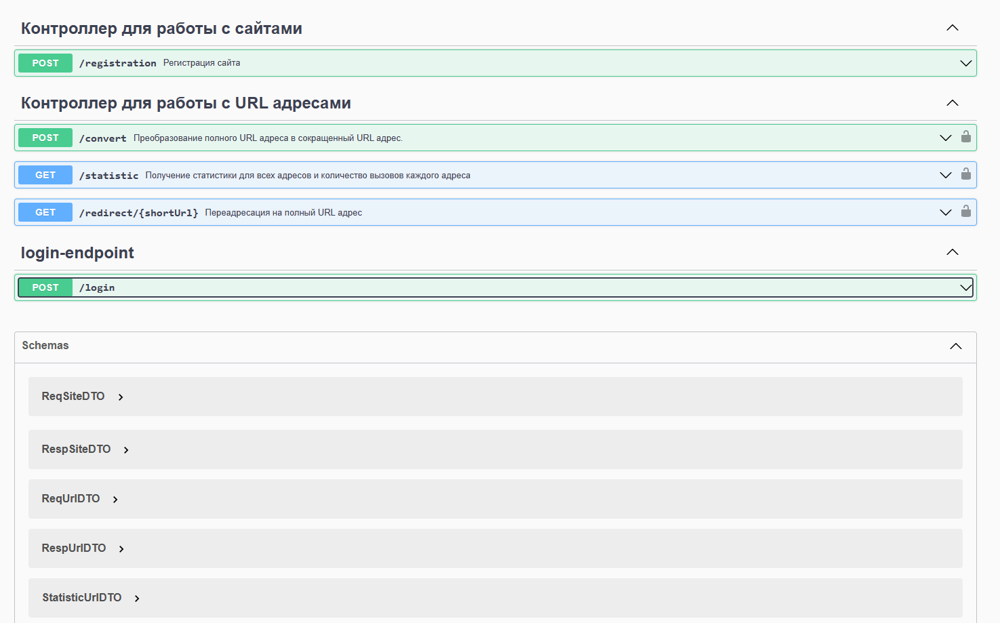

### Регистрация сайта
```shell
POST /registration
```
#### Сервисом могут пользоваться разные пользователи. Каждому пользователю выдается пароль и логин. Чтобы зарегистрироваться в системе нужно отправить запрос с телом JSON объекта:
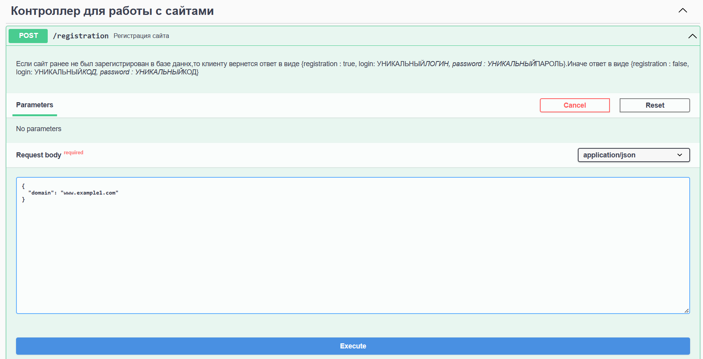
#### Ответ от сервера:
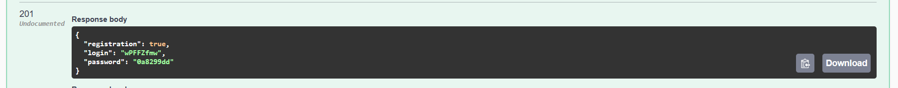

### Авторизация
```shell
POST /login
```
#### Авторизация выполняется с помощью JSON WEB TOKEN. Необходимо передать в теле JSON объекта сгенерированные логин и пароль:
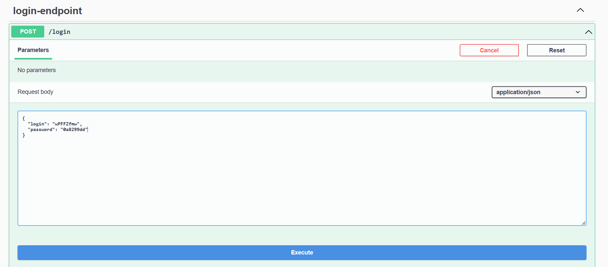
#### В ответ получаем JWT-токен из заголовка _Authorization_
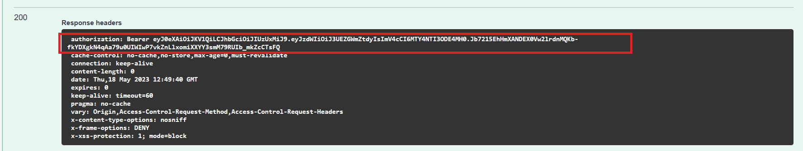
#### При авторизации необходимо ввести полученный JWT-токен
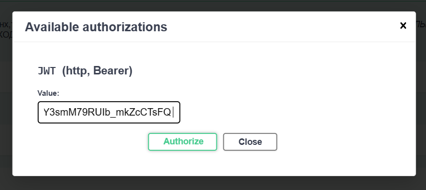
### Регистрация URL
```shell
POST /convert
```
#### После того как пользователь зарегистрировался он может отправлять ссылки и получать преобразованные ссылки:
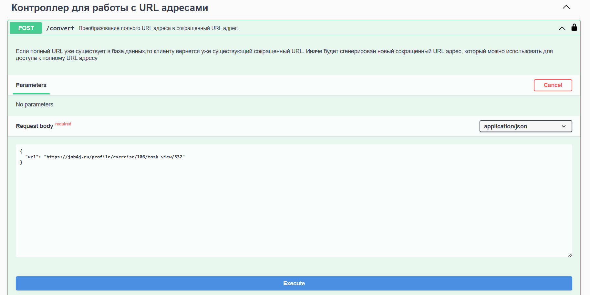
#### Ответ от сервера:
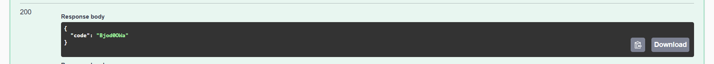
### Переадресация. Выполнятеся без авторизации
```shell
GET /redirect/{SHORT_URL}
```
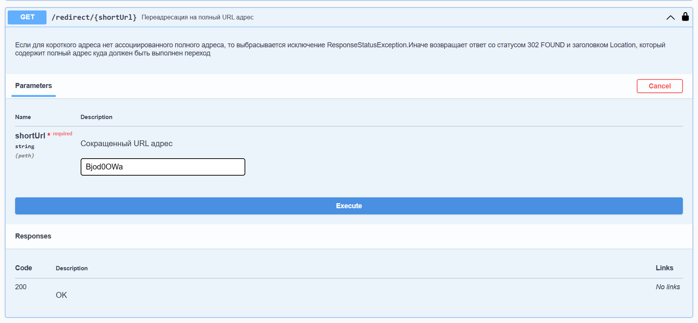
### Статистика
```shell
GET /statistic
```
#### По сайту можно получить статистику всех адресов и количество вызовов этого адреса:
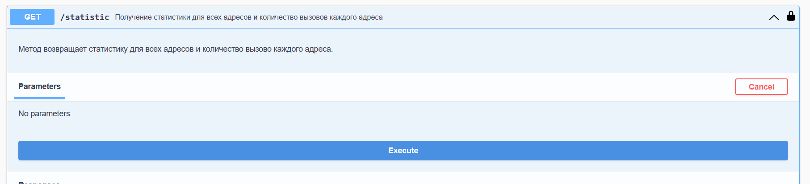
#### Ответ от сервера:
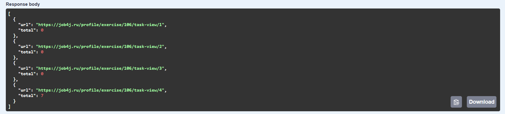
# Контакты
### Telegram: @Ilya96s

